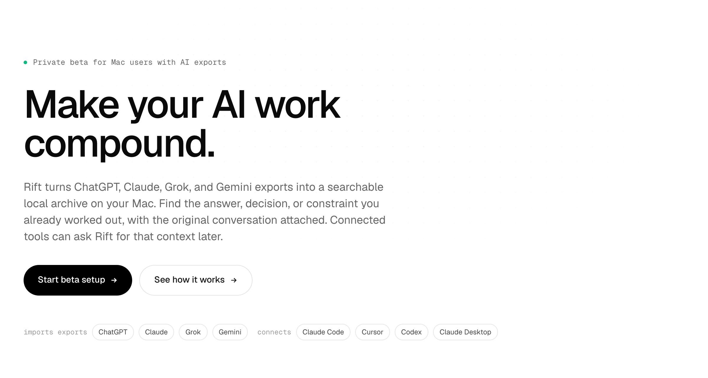
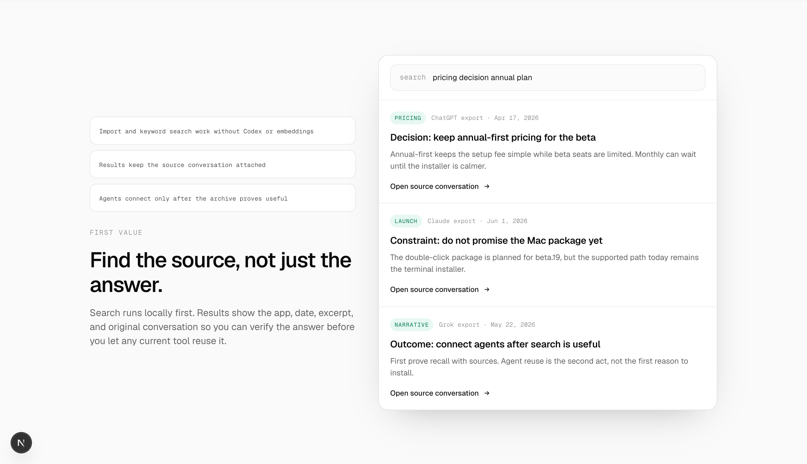
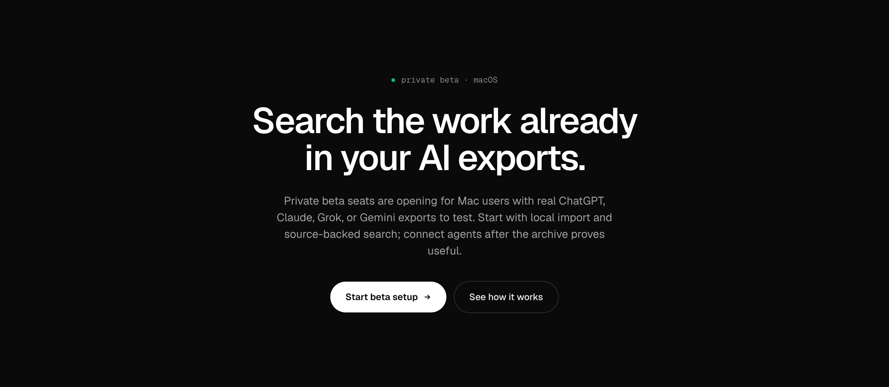

# Rift homepage — ruthless critique (v2)

_Date: 2026-06-02 · Reviewed live at `localhost:3000` (Chrome, desktop 1440 + mobile 390), against `app/home-content.tsx`._

---

## TL;DR — the blunt read

The page is **honest, tidy, and completely forgettable.** It reads like an internal changelog written by someone who is nervous about overclaiming, not like a product page built to make a high-fit Mac dev think *"I need this."*

Three things are killing it:

1. **It never shows the actual product.** Above the fold is a wall of grey text. The only "product moments" are a *fabricated* search UI and a *fabricated* terminal — and both are filled with Rift's own internal roadmap decisions, so they read as meta/self-referential instead of "here's what it does for you."
2. **The copy explains the mechanism before it lands the value.** "compound", "without Codex or embeddings", "FIRST VALUE", "served over MCP", "Truthful enough to ship" — this is the vocabulary of the person who *built* it, not the person who needs it.
3. **It actively plants doubt.** An entire section ("Beta status") leads with *"Truthful enough to ship"* and tells visitors the easy installer **doesn't exist yet** — before they've bought into anything. You're handing prospects reasons to leave.

**Overall: 4.5 / 10.** Clean typography and restraint are real assets. But it doesn't explain itself in 5 seconds, doesn't show itself, and doesn't make anyone *want* it. It will not convert cold or warm traffic at the rate this product deserves.

---

## The 5-second test (desktop fold)

What a first-time visitor actually parses in 5 seconds:

- Tiny grey mono line that looks like a log entry.
- **"Make your AI work compound."** → *Compound what? Money? This is a finance metaphor with no object.*
- A dense 4-sentence paragraph they won't read.
- A row of pills with mono labels `imports exports` and `connects` mashed against them → looks like debug metadata.

**Verdict: a visitor cannot tell what Rift *is* in 5 seconds.** It could be a notes app, a finance tool, an AI wrapper, a CLI. The single most important job of the fold — "what is this, who is it for, why should I care" — is not done.

---

## Section-by-section teardown

### 1. Hero — the abstraction trap

**What's broken**

- **H1 is a vibe, not a sentence.** "Make your AI work compound." has no subject. *Compound* is jargon borrowed from finance; nobody searches for or wants "compounding AI work." It sounds smart and says nothing. → **You already told me you want a longer, explicit H1. You're right.**
- **The eyebrow is a system log.** `Private beta for Mac users with AI exports` in 13px grey mono with a green dot reads like a terminal status line, not a welcome. It also front-loads three qualifiers (private / Mac / exports) before the value — it's a bouncer at the door before anyone knows there's a party.
- **The subtitle does the H1's job, badly.** 4 sentences, ~50 words. Because the H1 is empty, the paragraph is carrying *all* the meaning — so people have to *read* to understand, which they won't.
- **The pill row is the single most confusing element on the fold.** `imports exports [ChatGPT][Claude][Grok][Gemini] connects [Claude Code][Cursor][Codex][Claude Desktop]` — two lowercase mono labels jammed against 8 pills, no visual separation, no hierarchy. It's information, not communication. (You flagged this — confirmed: it looks like config output.)
- **No product. At all.** The fold is 100% text on white. The (fake) search UI doesn't appear until you scroll. There is zero "wow," zero motion that demonstrates value, zero screenshot of the real app.

**Fix direction**

- Longer, literal H1 that names the thing and the payoff. Candidates:
  - **"Every answer you've worked out with AI — searchable, and reusable by your coding agents."**
  - **"Turn your ChatGPT and Claude history into a private memory your AI tools can search."**
- Cut the subtitle to **one or two lines**, value + proof of safety:
  > *"Import your AI exports into a private archive on your Mac. Search it instantly — and let Claude Code, Cursor, and Codex pull the context instead of you re-pasting it."*
- Kill the mono eyebrow log. Make it a small, confident pill: **"Private beta · macOS"** — that's all it needs to carry.
- Replace the pill-soup with **a real product visual on the fold** (the search UI or the terminal moment — see below). Show, don't list.
- The "imports / connects" logos belong in a single quiet trust strip *under* the CTAs, not as the hero's main supporting element.

---

### 2. "Source search" proof — fabricated and self-referential

This is meant to be the money shot. It backfires.

**What's broken**

- **The demo searches for Rift's own pricing decision.** The query is `pricing decision annual plan` and the results are *Rift's internal roadmap*: "keep annual-first pricing for the beta", "do not promise the Mac package yet", "connect agents after search is useful." A visitor reads this and thinks: *why am I looking at this company's internal notes? Is this about me buying?* It's dogfooding leaking onto the sales page. (You flagged this — it's worse than "ugly," it's **confusing and off-topic.**)
- **The left rail is a stack of disclaimers, not benefits.** Three 11px grey mono boxes: *"Import and keyword search work without Codex or embeddings"*, *"Agents connect only after the archive proves useful."* This is **defensive engineering language.** A prospect doesn't know what Codex or embeddings are, and "works without X" frames your product by what it *doesn't* need. (Flagged — confirmed.)
- **Reading order is backwards.** Eye hits the three grey boxes → then "FIRST VALUE" kicker → then the actual headline. The headline should lead; right now it's buried third.
- **"FIRST VALUE"** is internal product-team vocabulary.

**Fix direction**

- Make the demo about **a real user's work**, not Rift's roadmap. Query something a dev would actually type: `how did we handle auth token refresh?` → results that look like *their* past conversations (a decision, a code snippet, a dead-end), each with source + date.
- Replace the three disclaimer boxes with **2–3 outcome statements** in normal type:
  - *"Find the decision, not just the answer — with the original conversation attached."*
  - *"Runs locally on your Mac. Nothing leaves your machine unless you say so."*
- Lead with the headline. Drop "FIRST VALUE."
- This should arguably **be the hero visual.** It's your most concrete asset — use it where eyes land first.

---

### 3. How it works — huge dead space, dusty framing

**What's broken**

- **~40% of this section is empty white.** The heading floats at the top with a cavernous gap before the three cards. The rhythm is broken — it feels like a layout bug, not breathing room.
- **"From old AI work to reusable context."** — *"old AI work"* sounds like dust and regret. It frames your input as stale junk.
- The three cards are competent but generic (01/02/03, green mono numbers, grey body). No diagram, no visual, nothing that earns the full-width section.

**Fix direction**

- Tighten the vertical spacing hard, or pull a **visual into the dead space** — a simple flow diagram (export → archive → search → agent) would do real work here.
- Reframe the headline to forward-looking value: **"Three steps from scattered chats to context your tools can use."**
- Step bodies are fine; just trim "old AI work."

---

### 4. Beta status — delete it, or move it to onboarding

**This is the most damaging section on the page.** It's a full-width, prominent block whose entire job is to **lower expectations.**

**What's broken**

- **"Truthful enough to ship. Narrow enough to learn."** — This is *founder-diary* language. It centers *your* honesty and *your* learning. A prospect doesn't care that you're being truthful; leading with "truthful enough" makes them wonder what's wrong. You're answering an objection nobody raised yet.
- **"The page stays lean because the product is still moving fast."** — Meta-commentary *about the page itself*, on the page. Never explain your own marketing to the visitor.
- **You announce the easy install doesn't exist.** `PLANNED FOR BETA.19` + *"Today's supported setup is the terminal installer. The Mac package is scoped, but not the live path yet."* — You're telling someone who hasn't committed that the friction-free path isn't ready. That's an onboarding detail; on the landing page it's a momentum-killer placed right before your terminal demo.
- The three grey status pills (`READY FOR INVITE TESTING` / `AVAILABLE AFTER SETUP` / `PLANNED FOR BETA.19`) make the page look like a **public Trello board**, not a product people pay for.
- "Import and keyword search work without Codex or embeddings" appears **a third time** here.

**Fix direction**

- **Cut this section from the landing page.** Honesty about beta scope belongs in the `/start` flow and docs, where someone who already wants in needs to set expectations.
- If you keep *any* of it, reduce to a single quiet line near the CTA: *"Private beta · macOS · terminal install today, one-click app coming soon."* One sentence, framed forward, not a status board.
- Replace the slot with something that **builds** confidence — a real privacy/local-first explainer, or a founder note, or the agent demo promoted up.

---

### 5. Agent terminal proof — your best asset, buried

**What's working** — This is genuinely good. The terminal showing Claude Code calling `rift_context_pack`, getting 4 memories, and writing the rate-limit middleware is the **clearest demonstration of value on the entire page.** It's concrete, credible, and "wow"-adjacent.

**What's broken**

- **It's near the bottom**, *after* the confidence-killing beta-status board. By the time people reach the strongest proof, the page has already taught them to be skeptical.
- Heading "Connected tools can reuse the same context." is flat and abstract.
- On smaller widths the terminal text gets tiny; needs a legibility pass.

**Fix direction**

- **Promote this up** — it should be the second thing after the hero (or part of the hero). Lead with your strongest, most concrete moment.
- Sharper heading: **"Your agent asks Rift mid-task — instead of asking you."**
- Consider a subtle typing/reveal animation so it reads as *live*, not a static screenshot.

---

### 6. Final CTA — fine, but repetitive

Solid dark section, good contrast, clear button. But "Search the work already in your AI exports." essentially **restates the hero**, and the body paragraph repeats the beta-scope caveats *yet again* ("connect agents after the archive proves useful" — third appearance of this exact idea). The page ends where it started instead of escalating.

**Fix:** make the closer an emotional escalation, not a recap. Add the one thing missing everywhere: a reason to act *now* (real seat scarcity, "free during beta, locks in your price", etc.) and drop the repeated caveats.

---

### 7. Mobile — the fold is all text, and the pills break

**What's broken**

- First viewport is **100% text**: 2-line eyebrow, giant H1, then an **8-line** subtitle. A mobile user scrolls past a paragraph before seeing a single proof.
- The pill row **collides with the floating chat widget** bottom-left — "Gemini" and "Codex" are partially hidden behind the (N) bubble. Looks broken.
- The 8-pill cluster wraps into a messy 3-row block with no hierarchy.

**Fix direction**

- Shorter H1 + shorter subtitle (per above) buys back the space to show a product visual or the search card in the first viewport.
- Reduce the logo strip to a single tidy line, and keep it clear of the floating widget's safe area.

---

## Cross-cutting problems

### A. The product is invisible
Two of three "proofs" are **fabricated mockups**, and both are populated with **Rift's own internal decisions**. There is **no screenshot of the real Rift app** anywhere. For a paid tool, people need to see the actual thing. Right now it's all abstraction and simulation.

### B. Mono-font overload signals "internal tool"
Eyebrows, kickers, labels, chips, captions, file names — almost everything secondary is in mono grey. The cumulative effect is **"developer changelog," not "product I pay €99/yr for."** Mono is a spice; here it's the whole meal. Reserve it for genuine code/terminal contexts.

### C. Every section opens with the same tiny grey kicker
`FIRST VALUE` / `HOW IT WORKS` / `BETA STATUS` / `PRICING` — identical 12px grey mono tracking-wide labels. Repetitive, low-contrast, and they make every section feel like the same template. Vary the rhythm.

### D. The voice is defensive, not confident
"works without Codex or embeddings", "truthful enough to ship", "not the live path yet", "page stays lean", "after the archive proves useful." The whole page hedges. **Confidence converts.** State what it does, plainly, and move objections to where they belong (onboarding/docs).

### E. No conversion scaffolding
No social proof, no testimonial, no founder face, no "what you get in beta", no real urgency, no FAQ addressing the #1 fear (*"is my private AI history safe?"*) up front. Privacy is your strongest emotional hook and it's whispered in grey mono, not led with.

---

## Copywriting rewrite (ship-ready candidates)

**Eyebrow** (kill the mono log):
> Private beta · macOS

**H1** (longer, literal, names the thing + payoff — pick one):
> **Every answer you've worked out with AI — searchable, and reusable by your coding agents.**

> **Turn your ChatGPT, Claude, and Grok history into a private memory your AI tools can search.**

**Subtitle** (cut to 1–2 lines, lead with safety + payoff):
> Import your AI exports into a private archive on your Mac. Search it in a keystroke — and let Claude Code, Cursor, and Codex pull the context instead of you re-explaining it.

**Search-proof headline:**
> Find the decision, not just the answer.

**Search-proof support (replace disclaimer boxes):**
> Every result keeps its original conversation, app, and date — so you can trust it before you reuse it. Runs locally; nothing leaves your Mac unless you opt in.

**How-it-works headline:**
> Three steps from scattered chats to context your tools can use.

**Agent-proof headline:**
> Your agent asks Rift mid-task — instead of asking you.

**Words to retire on the landing page:** *compound, FIRST VALUE, without Codex or embeddings, served over MCP, Truthful enough to ship, the page stays lean, not the live path yet, old AI work.*

---

## Recommended page order

1. **Nav**
2. **Hero** — clear H1 + short subtitle + **real product visual** (search card or terminal) on the fold
3. **Agent terminal proof** — your strongest moment, promoted up
4. **Source-backed search proof** — with *realistic user* content, not Rift's roadmap
5. **Local-first / privacy** — lead with the emotional hook, in plain type
6. **How it works** — tightened, with a flow visual
7. **Pricing** (when shown) + final CTA with a real reason to act now
8. ~~Beta status~~ → moved into `/start` onboarding
9. **Footer**

---

## Priority fixes

| # | Severity | Fix |
|---|----------|-----|
| 1 | **P0** | Rewrite the H1 to literally say what Rift is + the payoff; cut the subtitle in half. |
| 2 | **P0** | Put a **real product visual above the fold**. Stop leading with a text wall. |
| 3 | **P0** | Re-populate both mockups with **realistic user content**, not Rift's internal pricing/roadmap. |
| 4 | **P0** | **Remove the Beta-status section** from the landing page (move scope-setting to onboarding). |
| 5 | **P1** | Promote the agent terminal demo to right under the hero. |
| 6 | **P1** | Replace disclaimer-style support copy ("without Codex…") with confident outcome copy. |
| 7 | **P1** | De-mono the page; reserve mono for actual code/terminal. Vary the section kickers. |
| 8 | **P1** | Fix the hero pill-soup: one quiet logo strip under the CTAs, not the main support element. |
| 9 | **P2** | Fix mobile: shorter copy, product visual in first viewport, keep pills clear of the floating widget. |
| 10 | **P2** | Add conversion scaffolding: privacy-first reassurance, real urgency, optional social proof. |

---

## Screenshots index
- `shots/desktop-fold.png` — desktop above the fold
- `shots/hero.png` — hero section
- `shots/search-proof.png` — fabricated search proof
- `shots/how-it-works.png` — how it works (dead space)
- `shots/beta-status.png` — beta status board
- `shots/tool-call.png` — agent terminal proof
- `shots/cta.png` — final CTA
- `shots/mobile-fold.png` — mobile fold
