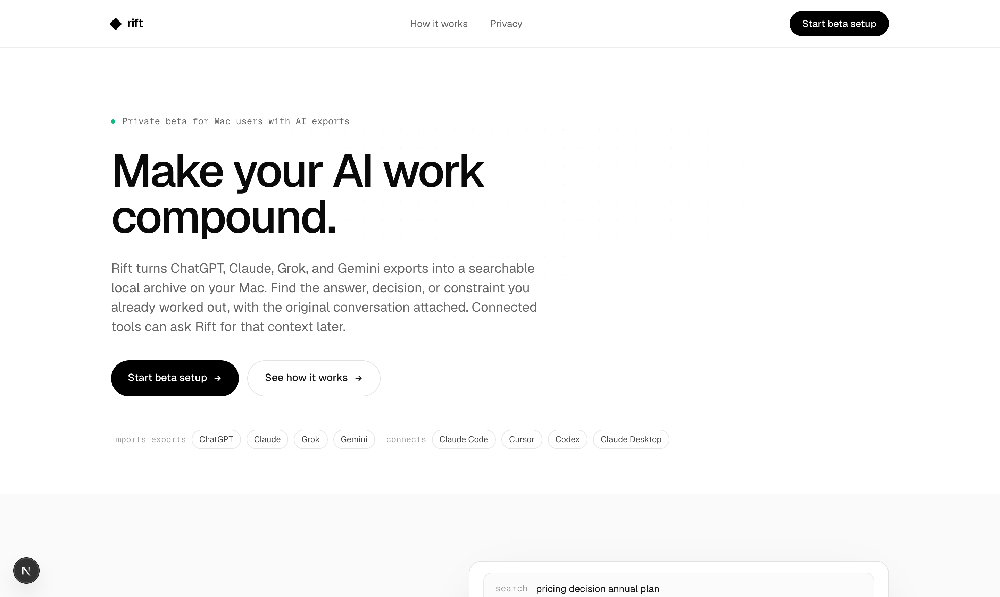
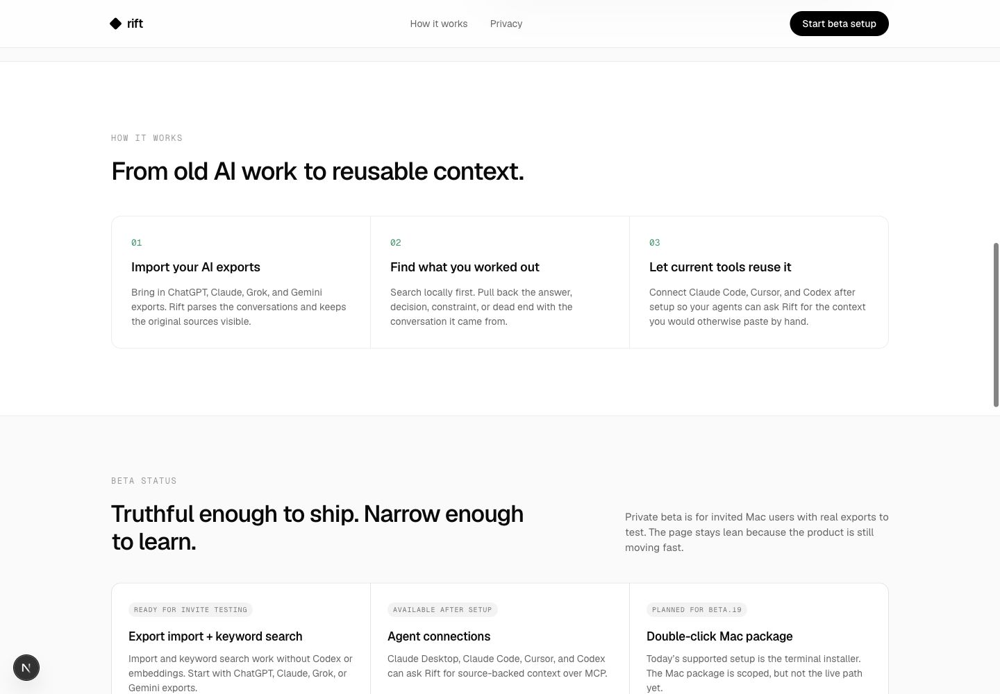
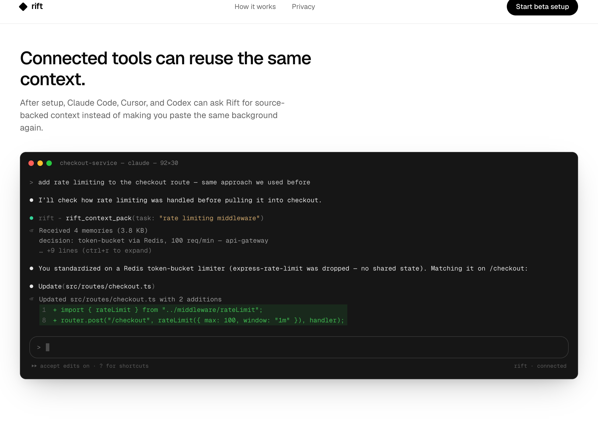
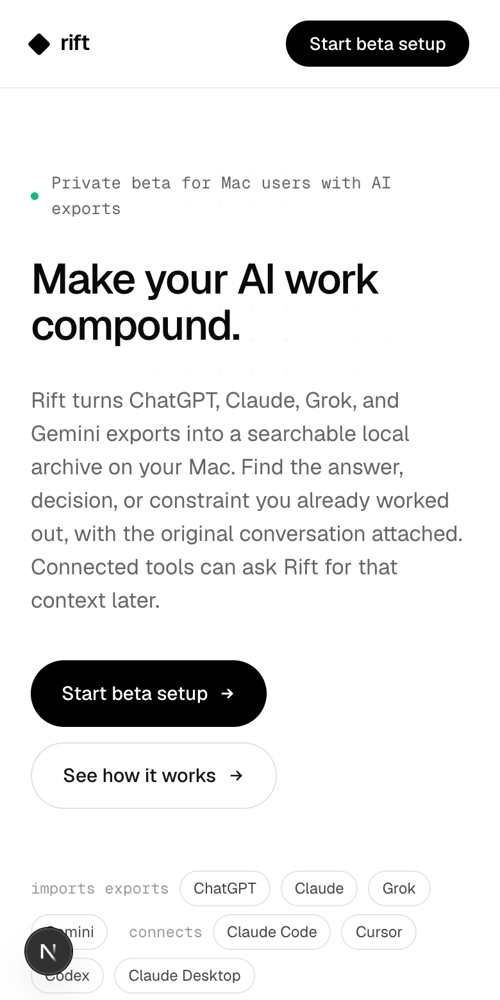

# Rift localhost ruthless landing-page critique

Audited on 2026-06-02 against `http://localhost:3000/`.

Source inspected:
- `app/home-content.tsx`
- `app/globals.css`

Screenshots captured from the live local page:










## Executive verdict

The page is honest, but it is not yet a high-converting landing page. It reads like a cautious release note wrapped in a minimalist SaaS shell. The problem is not that the claims are wrong. The problem is that the visitor has to work too hard to understand the product, feel the pain, see the payoff, and believe the beta is worth joining.

Current score:

| Dimension | Score | Verdict |
|---|---:|---|
| Value-prop clarity | 5/10 | The ingredients are present, but the promise is too abstract. |
| Conversion force | 4/10 | CTAs exist, but the page does not create urgency or desire. |
| Visual distinctiveness | 3.5/10 | Clean but forgettable; too much generic monochrome SaaS. |
| Product proof | 5/10 | The terminal proof is promising, but too late and too static. |
| Beta momentum | 3/10 | The page explains caution instead of making beta access feel valuable. |
| Trust | 6/10 | Strong privacy posture, but expressed in implementation-detail copy. |

The single biggest issue: **Rift's strongest promise is buried.** The page should make this obvious within five seconds:

> Rift turns your old ChatGPT, Claude, Gemini, and Grok exports into searchable local memory that Claude Code, Cursor, and Codex can reuse.

Right now the hero says:

> Make your AI work compound.

That is a tagline. It is not a landing-page headline for a new category.

## Five-second test

What a visitor probably understands:
- It is called Rift.
- It is for Mac.
- It has something to do with AI exports.
- It may connect to Claude Code, Cursor, Codex, and Claude Desktop.

What they likely do not understand fast enough:
- Whether this is an app, CLI, MCP server, search tool, memory layer, or backup tool.
- What they get immediately after setup.
- Why their old AI exports are valuable enough to import.
- Why they should join now, before the product is fully polished.
- Whether the page is for developers, founders, PMs, AI power users, or all of them.

That ambiguity kills conversion. Private beta visitors forgive roughness, but they do not forgive confusion.

## Current block sequence critique

Current sequence:

1. Hero
2. Source search proof
3. How it works
4. Beta status
5. Agent terminal proof
6. Final CTA

This is the wrong emotional sequence.

The current page first makes a conceptual promise, then shows a search UI, then explains the steps, then interrupts momentum with beta status, then finally shows the most interesting agent workflow. The strongest moment arrives after the product has already talked itself down.

Recommended sequence:

1. **Hero: clear product promise + one strong product visual**
   - Lead with what Rift does, what it works with, and what outcome it creates.
   - Show the product moment immediately: search old conversations, get a source-backed answer, pass context to an agent.

2. **Pain: your AI work is scattered and non-compounding**
   - One tight before/after. No long education.
   - Before: "I know we decided this in Claude or ChatGPT somewhere."
   - After: "Rift finds the decision and the original source."

3. **First value: source-backed search**
   - This is the first thing beta users can trust today.
   - Show one crisp query and one answer with citations, not a generic result list.

4. **Second value: agents reuse the context**
   - Move the terminal proof up.
   - It is the first visual that makes Rift feel like more than a local archive.

5. **Compatibility: imports from / connects to**
   - Keep this as a compact compatibility strip.
   - Do not split it into tiny chips in the hero where it feels like metadata.

6. **Trust: local-first, opt-in AI**
   - Say this in human terms, not implementation terms.
   - "Search works before you connect any model or embedding provider."

7. **Private beta: what works now, who should join, what opens next**
   - This replaces the current beta status board.
   - Make beta feel like selective access, not a disclaimer.

8. **Final CTA**
   - Repeat the concrete promise.
   - Ask for the right action: join/request/start depending on what the `/start` flow actually does.

## Hero

Screenshot: `./screenshots/rift-home-desktop-hero.png`

### What is failing

The hero looks clean, but it is underpowered. It has the shape of a premium landing page without the substance of one.

Problems:
- **The H1 is too clever for the category maturity.** "Make your AI work compound" only lands after someone already understands Rift. New visitors do not.
- **The eyebrow is a weak first sentence.** "Private beta for Mac users with AI exports" is an eligibility filter, not a promise. It makes the product feel narrow before it feels valuable.
- **The subtitle carries too much explanatory weight.** It does the real positioning work, but as a paragraph. That is backwards. The H1 should do the positioning, the subtitle should reduce friction.
- **The first viewport wastes the right half of desktop.** Huge empty space can feel premium when the message is sharp. Here it feels unfinished.
- **The product visual is only partially visible at the fold.** The page hides the thing that could make the product concrete.
- **The chips are taxonomy, not persuasion.** "imports exports" and "connects" are useful facts, but they are not worth this much prime hero space.
- **"Start beta setup" is too procedural.** It sounds like installing something before I know why I want it. For a cold landing page, that is high-friction copy.

### What to do instead

Use a longer, explicit H1. The user is right: clarity beats brevity here.

Recommended H1:

> Turn ChatGPT, Claude, Gemini, and Grok exports into searchable memory for Claude Code, Cursor, and Codex.

Shorter variant:

> Search your old AI conversations. Reuse the answers in your next agent session.

Sharper beta variant:

> Your best AI work is buried in exports. Rift turns it into local memory on your Mac.

Recommended subtitle:

> Import your exports, search locally with sources attached, and connect agents only when the archive is useful.

Recommended eyebrow:

> Private Mac beta · new seats opening soon

Recommended CTAs:
- Primary: **Join the Mac beta**
- Secondary: **See the product moment**

If `/start` is truly an immediate installer/setup path, use:
- Primary: **Start Mac setup**
- Secondary: **See what you get first**

Do not use "Start beta setup" unless the visitor is already convinced.

## Source-search proof

Screenshot: `./screenshots/rift-home-search-proof.png`

### What is working

This section has the right strategic instinct: the first sell should be **source-backed recall**, not agent magic. That is believable for a beta and it maps to the current product state.

### What is failing

The execution makes the product feel smaller than it is.

Problems:
- **The three proof chips are defensive implementation notes.**
  - "Import and keyword search work without Codex or embeddings"
  - "Results keep the source conversation attached"
  - "Agents connect only after the archive proves useful"
  
  These are true, but they read like internal launch-claim cleanup. A user does not wake up wanting "keyword search without embeddings." They want to find the thing they already figured out.

- **The query is too internal and too low-drama.** "pricing decision annual plan" feels like a founder planning note. It does not dramatize the pain of losing valuable AI work.

- **The visual says search results, but the copy says answer.** The heading is "Find the source, not just the answer." The UI shows three cards, not a source-backed answer. That weakens the promise.

- **The result examples are too meta.** "Outcome: connect agents after search is useful" is literally the page narrating itself. It feels fabricated.

- **The section does not show the "oh shit" moment.** The moment should be: "I forgot where this decision came from; Rift found it, attached the source, and made it reusable."

### Better direction

Turn this into a product proof moment:

Query:

> why did we reject express-rate-limit?

or:

> what did we decide about the Mac installer privacy defaults?

Answer card:

> You rejected `express-rate-limit` because it had no shared state across workers. The team standardized on Redis token-bucket, 100 req/min, in the API gateway.

Sources:
- Claude export · May 14
- ChatGPT export · Apr 22
- Project note · optional if supported

Actions:
- Open original conversation
- Send context to Claude Code
- Copy source-backed summary

Replace the current chips with benefits:
- **No model key needed to start**
- **Every result keeps its source**
- **Agent access stays opt-in**

This keeps the trust story but stops leading with implementation language.

## How it works

Screenshot: `./screenshots/rift-home-how-beta-board.png`

### What is failing

The section is structurally correct and emotionally flat.

Problems:
- **The heading is generic.** "From old AI work to reusable context" is accurate, but it sounds like category copy from any AI memory product.
- **The three cards are a common SaaS pattern.** Number, title, body. Nothing memorable. Nothing visually explains the transformation.
- **The copy repeats the hero instead of advancing the story.**
- **The section is too static for a workflow product.** Rift is a pipeline: exports come in, source-backed memories come out, agents request context. The visual should show motion or transformation.

### Better direction

Keep the three-step logic, but make it outcome-driven:

1. **Drop in your exports**
   - ChatGPT, Claude, Gemini, and Grok exports become one local archive on your Mac.

2. **Ask what you already solved**
   - Rift finds the decision, constraint, or dead end and keeps the original conversation attached.

3. **Let agents pull the missing context**
   - Claude Code, Cursor, and Codex can request a bounded context pack instead of making you paste background manually.

Visual recommendation:
- Replace three flat cards with one horizontal pipeline:
  - messy export files
  - Rift local index
  - source-backed answer
  - agent context pack

This can still be lean and beta-appropriate. It does not need a giant polished product video. It needs one visual system that explains the product in two seconds.

## Beta status

Screenshot: `./screenshots/rift-home-how-beta-board.png`

### What is failing

This is the most damaging section.

Problems:
- **"Truthful enough to ship. Narrow enough to learn." sounds like founder self-talk.** It communicates anxiety, not confidence.
- **"Beta status" makes the page feel like a changelog.** A visitor looking for value suddenly gets internal status reporting.
- **"Planned for beta.19" is too internal.** Nobody outside the project knows or cares what beta.19 means.
- **"Double-click Mac package" is a negative proof point.** It highlights that setup is not polished yet. That may need disclosure, but not as a major card in the conversion path.
- **"Import and keyword search work without Codex or embeddings" repeats the implementation-detail problem.**

### Better direction

Replace "Beta status" with **"Private beta: what you get today"**.

Suggested section:

Heading:

> Private beta for people with real AI history to import.

Body:

> Rift is opening new Mac seats for users with ChatGPT, Claude, Gemini, or Grok exports. The beta is intentionally narrow: prove local search first, then connect agents when the archive is useful.

Cards:

1. **Live now**
   - Import AI exports
   - Search locally
   - Open the original conversation behind every result

2. **Opt-in after setup**
   - Claude Code, Cursor, Codex, and Claude Desktop can ask Rift for context
   - AI enrichment and capture are off until enabled

3. **Coming next**
   - Double-click Mac installer
   - Faster backfill
   - More guided import diagnostics

If there are limited seats, say the number. Scarcity only works when it is concrete:

> New beta seats open in batches. We are prioritizing Mac users with large AI exports and active Claude Code/Cursor/Codex workflows.

Do not say "limited seats" vaguely. Vague scarcity smells like marketing. Concrete constraints feel real.

## Agent terminal proof

Screenshot: `./screenshots/rift-home-agent-terminal.png`

### What is working

This is the most compelling visual on the page. It shows a real workflow: an agent needs prior context, Rift returns memories, the agent applies the decision.

This should probably be above the beta status section, and possibly become the hero visual.

### What is failing

Problems:
- **It arrives too late.** This is the first moment where Rift feels powerful.
- **The heading is still generic.** "Connected tools can reuse the same context" is accurate, but it is not vivid.
- **The terminal is dense and dark after a very airy white page.** The contrast helps, but the transition feels abrupt because the rest of the page has no strong visual language.
- **The example is developer-specific.** That may be correct if the beta target is primarily Claude Code/Cursor/Codex users. If not, the page needs one non-code example too.

### Better direction

Move this directly after source search.

Heading:

> Your next agent session can start with the context you already earned.

Subtitle:

> Rift returns a small source-backed context pack instead of dumping old transcripts into the prompt.

Tighten the terminal copy:
- User asks a real task.
- Agent calls `rift_context_pack`.
- Rift returns 3-4 memories with source names.
- Agent makes the correct edit.

The current terminal has the right bones. It needs to become a hero-grade product artifact, not a late-page appendix.

## Mobile

Screenshot: `./screenshots/rift-home-mobile-hero.png`

### What is failing

Mobile is especially weak because the first screen is all explanation and no proof.

Problems:
- **The H1 is still too abstract.**
- **The subtitle becomes a heavy paragraph.**
- **The chips wrap into a cluttered metadata pile.**
- **No product visual appears before the first scroll.**
- **The floating black circular widget at bottom-left competes with the CTA and chips.** If that is the Next dev overlay, ignore for production. If it is product UI, it should not sit there.

### Better mobile direction

Mobile first viewport should be:
- Eyebrow: `Private Mac beta`
- H1: concrete product promise
- One short subtitle
- Primary CTA
- A compact mini product proof card

Example:

> Query: "what did we decide about rate limits?"
>
> Rift found 4 memories from Claude + ChatGPT, with sources attached.

Then show compatibility lower down.

## Copywriting diagnosis

The current copy has three repeated weaknesses:

1. **Too much abstraction**
   - "AI work"
   - "compound"
   - "context"
   - "archive proves useful"
   - "source-backed context"

2. **Too much implementation language**
   - "keyword search"
   - "without Codex or embeddings"
   - "MCP"
   - "beta.19"

3. **Too much maker-facing caution**
   - "Truthful enough to ship"
   - "Narrow enough to learn"
   - "The page stays lean because the product is still moving fast"

The replacement voice should be:
- concrete
- outcome-led
- trust-first but not defensive
- beta-confident
- technically literate without sounding like release notes

## Suggested copy replacements

| Current | Problem | Replace with |
|---|---|---|
| Private beta for Mac users with AI exports | Eligibility before value | Private Mac beta · new seats opening soon |
| Make your AI work compound. | Abstract; assumes understanding | Turn ChatGPT, Claude, Gemini, and Grok exports into searchable memory for Claude Code, Cursor, and Codex. |
| Rift turns... into a searchable local archive... | Good content, too much paragraph work | Import your exports, search locally with sources attached, and connect agents only when the archive is useful. |
| Start beta setup | Procedural; too early | Join the Mac beta / Start Mac setup |
| See how it works | Generic | See the product moment |
| Import and keyword search work without Codex or embeddings | Internal implementation detail | Search works before you connect any model or embedding provider. |
| Agents connect only after the archive proves useful | Good principle, awkward phrasing | Agent access stays off until you opt in. |
| Find the source, not just the answer. | Good but could be sharper | Find the decision and the conversation behind it. |
| From old AI work to reusable context. | Generic | From scattered exports to agent-ready memory. |
| Truthful enough to ship. Narrow enough to learn. | Sounds apologetic | What works in the private beta today. |
| Planned for beta.19 | Internal | Coming next |
| Connected tools can reuse the same context. | Generic | Give your next agent the context you already worked out. |

## Recommended page narrative

Use one consistent narrative:

1. **Problem**
   - Your best AI work is trapped in old ChatGPT, Claude, Gemini, and Grok conversations.

2. **Outcome**
   - Rift turns those exports into searchable local memory on your Mac.

3. **Proof**
   - Search a decision and open the original conversation behind it.

4. **Leverage**
   - Claude Code, Cursor, and Codex can request the right context when you opt in.

5. **Trust**
   - Local search works before keys, embeddings, enrichment, or capture.

6. **Beta**
   - New seats are opening for Mac users with real exports.

This is much stronger than the current narrative:

1. Rift is in beta.
2. It imports exports.
3. It searches locally.
4. It may connect to agents.
5. Here is status.
6. Here is a terminal.

## Visual direction

The page currently has no memorable visual idea. It is mostly:
- white background
- black type
- subtle dot grid
- rounded cards
- mono labels
- fake product windows
- small emerald accents

That is tasteful, but it is also generic. If someone said "an AI generated this landing page," I would believe them.

Not because it uses the worst AI cliches. It avoids purple gradients and noisy glassmorphism. The issue is safer: **generic premium minimalism with no product-specific visual language**.

Rift needs a visual metaphor tied to the product:

Option A: **Evidence trail**
- Search result cards behave like evidence.
- Every answer has a source stamp, app, date, and original conversation.
- Visual language: document stamps, source rails, highlighted excerpts, connected citations.

Option B: **Memory routing**
- Old exports flow into a local index.
- Current agents request small context packs.
- Visual language: lanes, packets, terminal calls, local boundary.

Option C: **Mac-native archive**
- Lean local utility, more like Spotlight + Time Machine for AI chats.
- Visual language: Finder-like import stack, Spotlight search, local vault, source preview.

My recommendation: **Evidence trail + Mac-native archive**. It fits the trust-first story and avoids overpromising "AI memory magic."

## Bento / card visuals

The full feature bento is currently hidden behind `SHOW_FULL_PAGE = false`, but the same card logic appears in the live how/status sections. If the full bento comes back, do not ship it unchanged.

What to avoid:
- equal-card grids with tiny pseudo-diagrams
- generic "memory follows you" phrasing
- mini UI widgets that look like decoration instead of product evidence
- internal claims like "Live files beat stale chats" unless the behavior is fully verified and easy to understand

What to do instead:
- Use fewer, larger visuals.
- Make each visual demonstrate one real before/after.
- Prioritize screenshots/mockups of:
  - import source list
  - local search result with source
  - original conversation preview
  - `rift_context_pack` agent response
  - opt-in privacy boundary

The bento should not be "six things Rift can do." It should be "three ways Rift saves you from re-explaining work."

## Trust and privacy copy

The trust story is important, but it is currently too defensive.

Bad pattern:

> Import and keyword search work without Codex or embeddings.

Better:

> You can import and search before connecting any model, embedding provider, or agent.

Best:

> Start with local search. Add model-powered features only when you choose.

Use progressive disclosure:
- Hero: "Local search first. Agents opt in later."
- Trust section: explain Codex/Voyage gates.
- Privacy page: full precise contract.

Do not put exact privacy implementation language in the hero proof chips.

## CTA and conversion

Current CTA issue:
- "Start beta setup" assumes readiness.
- The page does not say what happens next.
- Private beta momentum is weak.

Better CTA block:

Heading:

> Bring your AI history into the beta.

Body:

> We are opening new Mac seats for people with real ChatGPT, Claude, Gemini, or Grok exports. Start with local search, then connect Claude Code, Cursor, or Codex when you are ready.

Primary:

> Join the Mac beta

Secondary:

> Read the privacy contract

Add one expectation line near the CTA:

> Setup is terminal-based today. The double-click Mac installer is next.

That is honest without making the installer limitation a main status card.

## Nielsen heuristic score

This is adapted for a marketing page, so not every heuristic maps perfectly.

| # | Heuristic | Score | Key issue |
|---|---|---:|---|
| 1 | Visibility of system status | 2/4 | Beta status exists, but it reads like internal release status rather than visitor-relevant expectation setting. |
| 2 | Match with real world | 2/4 | Copy uses "compound", "context", "MCP", "embeddings", and "beta.19" before concrete user language is fully established. |
| 3 | User control and freedom | 3/4 | Clear privacy path and CTA, but unclear what "setup" commits the user to. |
| 4 | Consistency and standards | 3/4 | Visually consistent, but consistency is part of the flatness. |
| 5 | Error prevention | 3/4 | Trust claims are careful; setup caveat is present. |
| 6 | Recognition rather than recall | 2/4 | Users must infer the product category and workflow from scattered chips, cards, and examples. |
| 7 | Flexibility and efficiency | 2/4 | Good compatibility facts, but no clear segmentation for dev vs non-dev beta users. |
| 8 | Aesthetic and minimalist design | 1.5/4 | Minimal, but not sufficiently distinctive or persuasive. |
| 9 | Error recovery | 2/4 | Not very applicable, but setup expectations are underexplained at CTA moments. |
| 10 | Help and documentation | 2.5/4 | Privacy link exists; "how it works" is present but generic. |
| **Total** |  | **23/40** | Usable and honest, but not conversion-grade. |

## Automated scan

Command:

```bash
npx impeccable --json app/home-content.tsx app/page.tsx
```

Result:

```json
[]
```

Interpretation: no deterministic pattern was flagged. This does **not** mean the page is strong. The page's failure is strategic and editorial: weak first impression, generic composition, internal-facing copy, and insufficient product drama.

## Priority issues

### P0: The hero does not explain the product clearly enough

Why it matters:
The hero is carrying a new category and a beta ask. "Make your AI work compound" is not enough.

Fix:
Use a concrete H1 that names sources, outcome, and destination tools. Put a product visual above the fold.

### P0: The page lacks a compelling product moment above the fold

Why it matters:
Visitors need to see why importing exports matters. Right now the proof is partially below the fold and the strongest visual is late.

Fix:
Move source-backed search and/or the agent terminal into the hero area.

### P1: The proof copy is too implementation-led

Why it matters:
"without Codex or embeddings" reassures the team, not the visitor. It makes the product sound technical before it feels useful.

Fix:
Translate trust claims into user outcomes. Keep exact technical gates for privacy/detail sections.

### P1: Beta status reduces confidence

Why it matters:
"Truthful enough to ship" and "beta.19" make the page feel like an internal preview, not a selective beta people should want to join.

Fix:
Replace with "What works today" + "Who we are inviting" + "What is next."

### P1: Visual identity is too generic

Why it matters:
The page is clean but not memorable. It does not create a "wow" moment or a strong category association.

Fix:
Choose a visual system: evidence trail, memory routing, or Mac-native archive. Apply it to hero, proof, and agent sections.

### P2: The section order interrupts momentum

Why it matters:
The page shows beta limitations before the strongest agent payoff.

Fix:
Move agent proof before beta status. Make beta status a confidence/eligibility section near the CTA.

### P2: Mobile has no product proof in the first viewport

Why it matters:
Mobile visitors get abstract copy and chips only.

Fix:
Show a compact search/answer card before or immediately after the first CTA.

## Recommended next version

Build a lean private-beta landing page, not a full public-launch homepage:

1. **Hero**
   - H1: "Turn ChatGPT, Claude, Gemini, and Grok exports into searchable memory for Claude Code, Cursor, and Codex."
   - Subtitle: "Import your exports, search locally with sources attached, and connect agents only when the archive is useful."
   - CTA: "Join the Mac beta"
   - Visual: source-backed answer card + original conversation/source rail.

2. **The pain**
   - "The answer exists. It is buried in an old AI conversation."
   - One before/after visual.

3. **First value**
   - Local search with source attached.
   - Replace result list with answer + citations.

4. **Agent reuse**
   - Move terminal proof here.
   - Make the terminal example tighter and more legible.

5. **Works with**
   - Import: ChatGPT, Claude, Gemini, Grok.
   - Connect: Claude Code, Cursor, Codex, Claude Desktop.

6. **Trust-first**
   - "Start with local search. Add model-powered features only when you choose."
   - Short bullets: no Rift cloud, no model call by default, sources stay local.

7. **Private beta**
   - What works today.
   - Who should join.
   - What is coming next.

8. **Final CTA**
   - Repeat the concrete promise.
   - Set setup expectations.

## Final blunt read

The current page is not embarrassing technically. It is embarrassing strategically because it knows too much about the implementation and not enough about the visitor's emotional state.

The visitor is not thinking:

> I need keyword search without embeddings.

They are thinking:

> I solved this already in some AI chat and now I cannot find it.

Or:

> My agent is asking me for context I already explained three times.

The page should obsess over those two moments. Everything else is secondary.

