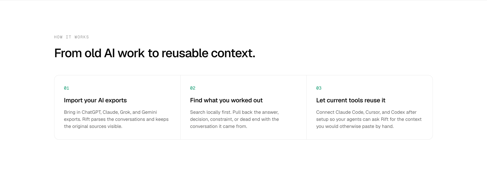
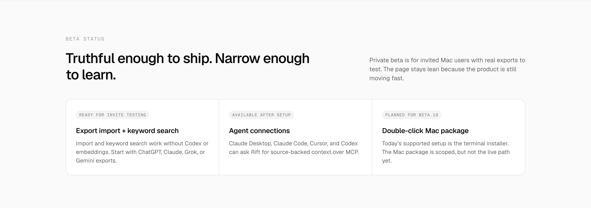

# Rift Landing Page — Ruthless Critique (June 2026)

**Audited:** 2026-06-02 on `http://localhost:3000/` (fresh `pnpm dev` + Playwright capture via `reviews/shoot.mjs`).  
**Sources:** `app/home-content.tsx`, `app/page.tsx`, `app/layout.tsx`, `app/globals.css`, `app/start/page.tsx`, rendered screenshots in `reviews/shots/`, prior plans/reviews (`RIFT_WEBSITE_DEEP_UPDATE_PLAN.md`, `RIFT_HOMEPAGE_LATEST_REVIEW.md`, `rift-localhost-ruthless-critique.md`), and product truth from `/Users/clement/projects/second-brain`.

**Screenshots captured for this review (current state, 2026-06-02):**

**Primary (desktop fold + key sections):**

**Additional fresh captures (in shots/):**
- `shots/desktop-fold.png` (hero + start of search)
- `shots/hero.png`
- `shots/cta.png`
- `shots/mobile-full.png`
- `shots/desktop-full.png` (very long)

Also see `reviews/screenshots/` (older but similar state) and `reviews/shots/` for the exact playwright output used in this pass. The "pricing decision annual plan" mock and beta cards are identical in spirit to what the prior review already flagged.

---

## Executive Verdict

**This page does not convert. It confuses, then apologizes.**

It is the visual and rhetorical equivalent of a careful internal status update dressed up as a landing page. Clean lines, plenty of whitespace, Geist + emerald dots — but zero "wow", zero emotional hook, and zero clear product promise in the first 5 seconds.

The user is right: it 100% looks shit for a landing page that needs to attract private beta users who have real AI history worth importing.

Current score (ruthless 2026-06-02):

| Dimension              | Score /10 | Verdict |
|------------------------|-----------|---------|
| Value-prop clarity     | 3         | Abstract slogan + paragraph wall. Visitor still doesn't know what they get in 60s. |
| Conversion force       | 2         | CTAs are procedural ("Start beta setup"). No desire, no scarcity that feels good, no proof of outcome. |
| Visual distinctiveness | 2         | Generic premium minimalism. Looks like every other "thoughtful" AI tool site from 2025. No Rift-specific visual language. |
| Product proof          | 4         | The terminal is the only moment that feels real. Everything before it is defensive or meta. |
| Beta momentum          | 1         | "Beta status" + "beta.19" + "Truthful enough to ship" actively repels. |
| Trust / honesty        | 7         | High on facts, but expressed in the worst possible framing (implementation caveats first). |
| Mobile experience      | 3         | Chips explode, no proof above fold, long text, cramped. |
| **Overall**            | **3**     | Not ready for hand-picked beta traffic, let alone wider. |

**The single biggest failure:** The page never shows a human moment ("I forgot the decision we made about X... oh, Rift found it with the exact chat attached"). Instead it shows founder notes about pricing strategy and installer scope.

---

## Five-Second Test (Fail)

**What a cold visitor actually understands in 5s:**

- Something called Rift exists.
- Private beta, Mac only.
- Involves AI exports (ChatGPT/Claude/etc) and some tools (Claude Code, Cursor...).
- "Make your AI work compound" — whatever that means.

**What they do NOT understand (and should, instantly):**

- Is this a desktop app? A CLI? A background service? An MCP thing I have to configure?
- Do I have to have Codex or pay for embeddings just to try the basic thing?
- What do I literally get 2 minutes after I click the button? A folder of JSON? A search UI? Something in my terminal?
- Why should I dig up old exports *now* instead of just starting fresh?
- Is this for solo founders/PMs/engineers who live in AI chats, or only hardcore Cursor + Claude Code users?

Result: high bounce or "I'll come back when it's an app".

---

## Section-by-Section Breakdown

### 1. Hero (The most damaging part)

**Current:**
- Eyebrow pill: "Private beta for Mac users with AI exports" (green dot)
- H1: "Make your AI work compound."
- Subtitle: long 4-line paragraph explaining the whole product.
- Bottom chips: "imports exports" + 4 sources | "connects" + 4 tools (wraps horribly on mobile).
- CTAs: "Start beta setup" (primary, black) + "See how it works".

**Ruthless problems (user called these out):**

- The pill puts eligibility before value. It reads as "you may not be allowed" instead of "this is for people who have history worth saving".
- H1 is a tagline that only makes sense *after* you understand the product. It is not a headline. "Compound" is abstract corporate poetry.
- Subtitle is doing all the explanatory work and is boring. Too long, too many concepts crammed ("searchable local archive", "source-backed", "connected tools can ask later").
- The chip row is taxonomy, not persuasion. It looks like feature matrix leftovers. On mobile it becomes visual noise.
- Wasted real estate: huge empty right side on desktop above the fold. No product moment, no search card, no before/after, nothing that makes the promise concrete.
- "Start beta setup" is anti-desire language. It sounds like homework you have to qualify for.

**User directive alignment:** You explicitly want a *longer, crystal-clear H1* if that's what it takes, and to shrink the subtitle.

**Recommended replacement direction (to be designed, not just copy-pasted):**

Eyebrow: `Private Mac beta — new seats opening soon`

H1 (longer, explicit, names the inputs + output + destinations):

`Import your ChatGPT, Claude, Grok, and Gemini exports. Search every decision, constraint, and dead-end you already worked out — with the original conversation attached. Then let Claude Code, Cursor, and Codex pull that context when they need it.`

Subtitle (shorter, one job only):

`Local search works immediately. Agent connections are opt-in after the archive proves useful.`

Primary CTA: `Join the Mac beta` (or `Start Mac setup` if the flow is truly open self-serve for invited people).

Secondary: `See a real example`

Visual: above the fold or immediately below, a compact, high-signal "search result + source rail" or a mini version of the terminal moment. Do not leave the right half empty.

### 2. Source Search Proof ("pricing decision annual plan" section)

**Current:** Light bg section with 3 tiny defensive cards on left ("Import and keyword search work without Codex or embeddings", "Results keep the source...", "Agents connect only after..."), big heading "Find the source, not just the answer.", and a fake search card on right with query "pricing decision annual plan" + 3 result cards that are literally the site's own narrative decisions (pricing, Mac package constraint, "outcome: connect agents...").

**This is the single most embarrassing element on the page right now.**

- The three left chips are pure internal reassurance language. No user wakes up wanting "keyword search without embeddings". They wake up wanting "I know we decided the annual thing somewhere, where the hell did I put that?"
- The query example is founder navel-gazing. "pricing decision annual plan" is the least relatable, least dramatic possible demonstration of value.
- The results are self-referential meta-commentary on the launch itself. It feels like a placeholder that never got replaced with a real, human, painful example.
- The visual "search UI" is fine in structure (search bar + cards), but the content makes the whole product feel small and internal.
- "Open source conversation" link text appears but there's no preview of what the conversation actually looks like.

**Fix direction:** Turn this into the first real "oh shit" moment.

Good query examples (pick one strong, real-feeling):
- "why did we drop express-rate-limit?"
- "what was the constraint on the Mac installer?"
- "did we already decide on annual vs monthly for beta?"

Result card should show:
- The actual decision / constraint / outcome in human language
- Source + date + app (Claude export · May 22)
- "Open original conversation" + "Copy source-backed summary" + "Send to Claude Code" actions
- Visual hint of the attached transcript/excerpt

Replace the 3 defensive chips with outcome chips:
- No keys or embeddings required to start
- Every result carries its source
- You decide when agents get access

This section should feel like the product, not a compliance checklist.

### 3. How It Works

**Current:** Standard 3-column numbered cards under "HOW IT WORKS" + generic heading "From old AI work to reusable context."

01 Import your AI exports  
02 Find what you worked out  
03 Let current tools reuse it

**Problems:**
- Pure boilerplate SaaS pattern. Zero visual interest, zero motion, zero "this is what actually happens on my machine".
- Copy is almost identical to the hero/subtitle. It advances nothing.
- No before/after, no export file → index → result → context-pack pipeline.
- On a page that is already very card-heavy and airy, three more identical rounded cards just add to the monotony.

**Recommendation:** Keep 3 steps conceptually (lean page), but make it one visual system:
- Horizontal or vertical flow with icons or simple illustrations.
- "Drop export.zip" → "Local index + sources visible" → "Search result with 'Open chat'" → "Agent calls rift_context_pack → gets 3 memories".
- Or a single "evidence trail" visual that shows a real decision with its source stamp traveling into an agent session.

Heading idea: "Three minutes from old export to agent-ready memory." or "Your AI history becomes one local, source-backed archive."

### 4. Beta Status (The trust killer)

**Current:** "BETA STATUS" / "Truthful enough to ship. Narrow enough to learn." + three cards:
- "ready for invite testing" → Export import + keyword search (repeats the defensive line)
- "available after setup" → Agent connections
- "planned for beta.19" → Double-click Mac package (explicitly calls out the worse current experience)

Plus body text explaining why the page is lean (because product moves fast).

**This section is actively harmful.**

- The headline is self-congratulatory founder therapy. It says "we are being honest" instead of "here is what you get and why you should care".
- "beta.19" is meaningless to anyone outside the project. It signals "we are still in heavy dev" not "selective early access".
- Putting the Mac package limitation as a full card makes the current terminal path feel like a second-class experience.
- It sits right in the middle of the page and completely kills momentum right before the only strong visual (the terminal).
- The whole thing reads like a changelog or internal launch checklist, not a marketing page.

**Replacement framing:** "Private beta — what works today"

- Live today (positive, bold): Import + local keyword search with sources. No Codex or embeddings required.
- After one setup step (opt-in): Claude Code / Cursor / Codex / Claude Desktop can pull context.
- Next (honest, not a status): Double-click installer, faster backfills, more import sources. We will announce when ready.

Make the section feel like "selective access to something that already delivers core value" rather than "early access to an incomplete tool".

If seat count is real and small, say the number or "batch 3 of 12 seats opening this week". Vague "private beta" + "narrow" just feels gatekept for no reason.

### 5. Tool Call Proof (The only good part — buried)

The dark terminal showing:
- User: add rate limiting...
- Agent decides to check prior work
- Calls `rift_context_pack`
- Gets "decision: token-bucket via Redis..." + source
- Agent then makes the correct edit

This is the first (and only) moment that makes Rift feel powerful and different.

**Problems:**
- Arrives *after* the beta status downer.
- Heading "Connected tools can reuse the same context." is still generic.
- The example is very dev-specific (rate limiting middleware, checkout-service, Redis). Fine if the beta is 90% Cursor/Claude Code power users, but a second, less code-heavy example would broaden appeal.
- Visual jump from super-light airy page to full-bleed dark terminal is abrupt. The page has no consistent visual language to support it.

**Recommendation:** Move this section up, right after or integrated with the search proof. Make the terminal the hero visual if we can make a clean crop. Tighten the transcript so the "aha" (agent used the memory and got the right outcome) is impossible to miss in 4 seconds.

### 6. CTA (Dark)

"Search the work already in your AI exports." + body that repeats the long explanation + same two CTAs.

It's fine as a closer, but it doesn't add new energy or final proof. The body text is too long again.

Better: short restatement of the concrete promise + one expectation line ("Terminal setup today. Double-click Mac package coming in the next beta wave.") + the primary CTA.

### 7. Mobile (Particularly bad)

- Long H1 still abstract.
- Subtitle becomes a dense paragraph.
- Chips wrap into two messy lines + "imports exports" labels.
- Zero product proof before first scroll.
- The search-proof and how-it-works cards stack but remain as defensive and flat as desktop.
- Beta status cards become a vertical list of caveats.

Mobile visitors get the worst possible first impression: abstract slogan + eligibility gate + taxonomy chips + "we're in beta and the nice installer isn't ready".

---

## Design System & Craft Issues (Why It "Looks Shit")

- **No distinctive visual language.** Dot grid + rotated square + tiny emerald dots + rounded-2xl cards + mono labels = "generic thoughtful AI tool #47". Nothing says "local evidence archive for your AI sessions" or "Mac-native but not cutesy".
- **Over-reliance on whitespace without confidence.** Lots of padding, but the sections don't feel deliberately composed — they feel like they ran out of things to say.
- **Card monotony.** Every feature, proof, status, step is a similar rounded card with light border. The terminal is the only break, and it comes late.
- **Fake UI quality is low.** The search "app" in the proof section and the terminal are the only attempts at product visualization. The search one is filled with bad content; the terminal is better but could be crisper (font, syntax highlighting, exact Claude Code aesthetics).
- **Accent and hierarchy weakness.** Emerald is used for tiny dots, tiny pills, tiny checkmarks. It never carries real visual weight. Headings are good size but the supporting text often has too little contrast or too much line length.
- **No "evidence" motif.** Given the core promise is *sources attached*, the design should feel more like annotated documents, stamped sources, citation rails, highlighted excerpts, connected threads — not clean SaaS cards.
- **Inconsistent logo treatment** (square rotated in code vs rendered diamond in some captures) and small details that feel unpolished at the fold.

The page is "minimal" but not "impeccable". It reads as "we kept it lean because we're moving fast" rather than "this is the distilled, confident expression of the product".

---

## Copywriting Patterns That Must Die

1. **Defensive implementation-first claims**
   - "Import and keyword search work without Codex or embeddings"
   - "Agents connect only after the archive proves useful"
   → Translate to user outcome: "Search works before you give Rift any model keys or let it touch your agents."

2. **Internal launch language**
   - "beta.19"
   - "Truthful enough to ship. Narrow enough to learn."
   - "The page stays lean because the product is still moving fast."
   → "What you can use today. What opens next. No marketing theater."

3. **Abstract corporate poetry in the hero**
   - "Make your AI work compound."
   → Name the concrete inputs and outputs.

4. **Self-referential / meta examples**
   - Using the site's own narrative decisions as the search proof.
   → Use a real, painful, relatable user scenario.

5. **Procedural CTAs**
   - "Start beta setup"
   → "Join the Mac beta" or "Start setup" once desire exists.

---

## Recommended High-Level Structure (Lean Private Beta)

1. **Hero** — long clear H1, short subtitle, strong primary CTA, *product moment visual or mini-proof above the fold or immediately under*.
2. **First value proof** — source-backed search with a human query + attached source + actions. (Kill the 3 defensive chips or reframe them as benefits.)
3. **Agent leverage** — the terminal moment (moved up). "Your next session in Claude Code / Cursor starts with what you already solved."
4. **How it actually works** (visual flow or tightened 3 steps).
5. **Who this is for + what works today** (replaces "Beta status" — positive, eligibility, honest next steps).
6. **Compatibility strip** (compact, or fold into how/hero).
7. **Final CTA** — repeat the promise + one honest setup note + primary action + privacy link.

Keep `SHOW_FULL_PAGE = false` for now. Do not bring back the old bento or carousel until the core story converts.

---

## Priority Fixes (P0 → P2)

**P0 — Hero does not explain the product**
- Replace H1 + subtitle + eyebrow + chips with crystal-clear, longer H1 version + short subtitle + one strong visual.
- Change primary CTA language.

**P0 — Search proof is using the worst possible example and defensive copy**
- New query, new result content, benefit chips instead of "works without X", real source preview.

**P0 — Beta status section destroys desire**
- Rename, reframe, remove "beta.19" as a headline feature, lead with what is live and useful today.

**P1 — Sequencing kills momentum**
- Move agent terminal proof before or right after search proof. Beta status becomes a late, confident, eligibility + roadmap note.

**P1 — No distinctive visuals or "wow"**
- Pick a visual system (evidence trail / source stamps / Mac archive / memory packets) and apply it consistently to hero proof, how-it-works, and terminal.
- Improve the quality and realism of the two product visuals (search card and terminal).

**P1 — Mobile is an afterthought**
- Hero must have a compact proof element in first viewport.
- Chips must not explode.
- Stacked cards need breathing room and stronger visual differentiation.

**P2 — Copy voice throughout**
- Audit every sentence for abstraction, implementation detail, and apologetic tone. Replace with concrete outcome + trust + beta confidence.

**P2 — Start page consistency**
- The `/start` page currently repeats some of the same defensive language ("Import and keyword search work without Codex..."). It must match the new homepage tone exactly.

---

## Final Blunt Read

A private beta landing page does not need to look like a $100M ARR company. It *does* need to make a qualified visitor think, within 8 seconds:

> "This thing would have saved me from re-explaining the same decision three times last week. I have the exports. I should try it."

Right now the page makes them think:

> "This is some local CLI memory thing for people who use Claude Code. Setup is terminal. The nice Mac app isn't ready yet. Also here are three reasons it might not work for me. Maybe later."

That is not a conversion page. It is a detailed, honest, but strategically confused product note.

Fix the hero to be crystal clear (longer H1 is allowed and necessary). Kill the defensive "without Codex" language from prime real estate. Burn the "pricing decision annual plan" example and the "Truthful enough to ship" headline. Give the visuals a reason to exist beyond filling space.

Then shoot again and re-critique.

---

*Generated from live localhost + Playwright + full source read + prior Rift website decision records (rift_context_pack + rift_search used for historical positioning and plan context).*

_Rift: retrieved prior homepage reviews, deep update plan, and positioning decisions (RIFT_WEBSITE_DEEP_UPDATE_PLAN.md + conversation history) → informed why the current "honest lean" execution still fails the user's crystal-clear + wow + convert requirements._